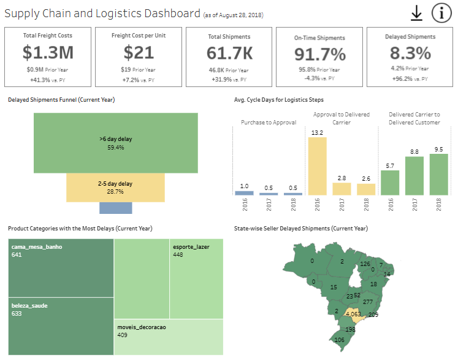
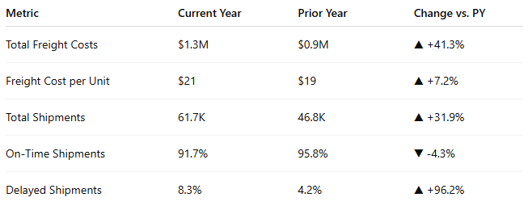
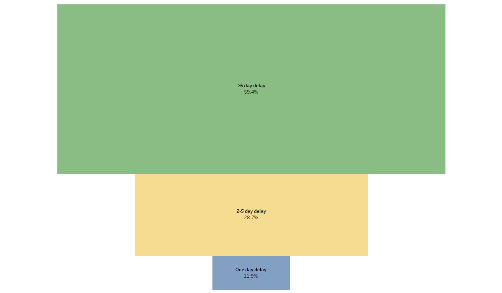
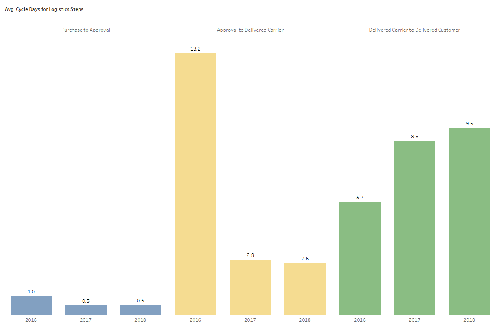
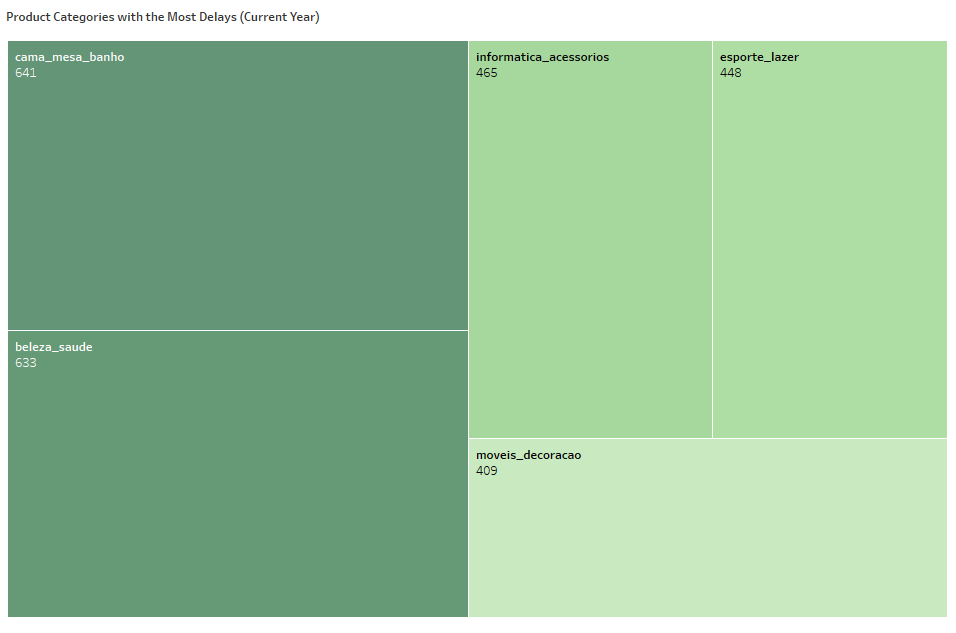
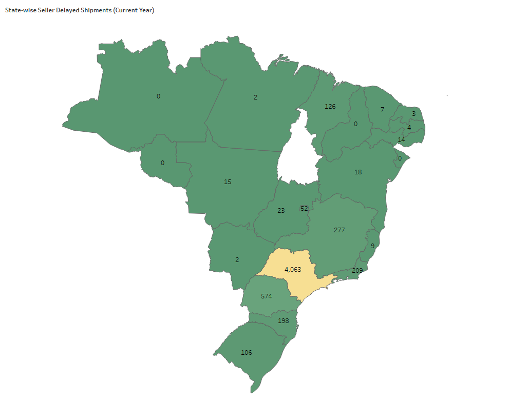

# Logistics and Supply Chain Analytics by Utilizing Tableau Dashboards

  
  Photo by Pauline Lu on Unsplash

## Problem Statement
Olist, the largest e-commerce store in Brazil, connects small businesses from all over Brazil to customers without hassle and with a single contract. Merchants can sell their products through the website and ship them directly to the customers using the Olist logistics partner.

After a customer purchases a product from the Olist website, a seller gets notified to fulfil the order. Once the customer receives the product, the customer gets a satisfaction survey by email where they can give a note on the purchase experience and write down some comments.

The supply chain and logistics management team at Olist currently depends on periodic ad-hoc reports for insights into freight cost, shipping delays, and delivery performance. While useful, these reports pose challenges in providing timely, consistent, and actionable insights, affecting decision-making efficiency and response capabilities.

Specifically, the following challenges exist:
* **Unreliable Data for Demand Planning**: Inconsistent and fragmented data sources hinder effective demand forecasting, leading to poor inventory and distribution decisions.
* **Lack of Real-Time Visibility**: The absence of real-time tracking limits the ability to respond quickly to market changes or supply chain disruptions.
* **Insufficient Granularity**: Current dashboards fail to provide performance insights at key levels—such as individual processes, products, or sellers—restricting root cause analysis and targeted action.
* **No Historical Benchmarking**: Without period-over-period comparisons, it’s difficult to assess whether supply chain performance is improving or declining over time.

## Goals
This project aims to enhance the supply chain visibility, specifically logistics visibility, and planning by building an interactive dashboard. The goal is to enable supply chain managers and teams to access consistent and real-time data for demand forecasting, monitor performance across product, process, and seller levels, and compare metrics across time periods. This will support data-driven decisions to optimize inventory, distribution, and overall supply chain efficiency.

## Key Definitions
Before getting into the dashboard analysis, it is important to understand some of the key terms used in the dashboard.

* **Freight Cost**: Cost of shipping an item
* **On-time Shipments**: Shipments delivered on or before the estimated delivery date
* **Delayed Shipments**: Shipments delivered after the estimated delivery date
* **Purchase Date**: The date when the online purchase was made 
* **Payment Approval Date**: The date when the payment was approved 
* **Delivered Carrier Date**: The date when the item was handed over to the logistics partner
* **Delivered Customer Date**: The date when the item was actually delivered to the customer
* **Purchase to Approval Cycle Days**: Number of days taken from the Purchase Date to the Payment Approval Date 
* **Approval to Delivered Carrier Cycle Days**: Number of days taken from the Payment Approval Date to the Delivered Carrier Date 
* **Delivered Carrier to Delivered Customer Cycle Days**: Number of days taken from the Delivered Carrier Date to the Delivered Customer Date 
* **Shipping Limit Date**: The estimated date to hand over the item to the logistics partner
* **Seller Delayed Shipments**: Shipments where the item was handed to the logistics partner after the shipping limit date

## Dashboard Analysis
### At a Glance

  
  Supply Chain and Logistics Dashboard in Tableau

At a glance, Olist’s logistics performance has seen both improvements and setbacks in the year 2018. While shipment volumes and total freight costs have increased significantly, operational challenges persist in on-time delivery performance and last-mile delivery delays. The delayed shipments rate has nearly doubled, indicating critical inefficiencies that need immediate attention.

### Key Metrics Overview

  
  Key Logistics KPIs for the current year 2018

* Significant growth in shipment volume (+31.9%) has driven up both freight costs (+41.3%) and unit shipping costs (+7.2%).
* However, on-time shipment performance declined by 4.3 percentage points, and the delayed shipments rate has almost doubled, highlighting stress on the logistics network.

### Delayed Shipments Funnel

  
  Delayed Shipments Funnel for the year 2018

* 59.4% of delayed shipments were delayed by more than 6 days. 
* 28.7% of delayed shipments were delayed by 2–5 days.
* 11.9% of delayed shipments were one-day delays

A majority of the delays are long-term, suggesting systemic issues in logistics handoff, last-mile delivery, or seller readiness.

### Cycle Time Analysis (2016-2018)
The following are the three major processes in the logistics supply chain:
1. **Purchase to Approval**: The time from when the customer makes a purchase on the Olist website to the time when the payment is approved.
2. **Approval to Delivered Carrier**: The time after payment approval to when the package is handed to the Olist logistics partner.
3. **Delivered Carrier to Delivered Customer**: The time from when the package is picked up by the logistics partner to the time when the package is actually delivered to the customer.

  
  Cycle Time Analysis for Logistics Processes  

* The Purchase to Approval process seems to be stable and efficient. The average cycle time reduced from 1 day in 2016 to 0.5 days in 2018.
* The average cycle time for the Approval to Delivered Carrier process spiked to 13.2 days in 2016, but improved to 2.5 days in 2018. Shows successful streamlining in upstream operations (e.g., seller processing or packaging).
* The average cycle time for the Delivered Carrier to Delivered Customer process increased from 5.7 days in 2016 to 9.5 days in 2018. Despite improvements upstream, last-mile delivery performance has worsened.

Efficiencies in payment and seller dispatch are being offset by poor carrier-to-customer delivery performance, possibly due to logistics partner constraints or geographic challenges.

### Product Categories with Most Delays

  
  Treemap Showing Product Categories with the Most Delays for the year 2018  

For people who don't know Portuguese like me, here is the translated version.
1. **Cama Mesa Banho (Bedding & Bath)** – 641 delays
2. **Beleza Saúde (Beauty & Health)** – 633 delays
3. **Informatica Accessories (Electronics)** – 465 delays
4. **Esporte Lazer (Sports & Leisure)** – 448 delays
5. **Móveis, Decoração (Furniture & Décor)** – 409 delays

The categories likely involve bulky, fragile, or specialty items with longer prep or shipping times. Targeting these for process improvements can yield quick wins.

### Geographic Bottlenecks - Seller Delayed Shipments

  
  State-wise Seller Delayed Shipments for the year 2018

* São Paulo (SP): 4063 delays (most affected state)
* Other high-delay states: Paraná (574), Minas Gerais (277), Rio de Janeiro (209)

The South and Southeast regions of Brazil are hotspots for delayed handoff from sellers to logistics partners. Root causes may include seller capacity constraints, traffic congestion, or urban warehouse bottlenecks.

## Actionable Recommendations
### Last-Mile Optimization 
* Re-evaluate carrier SLAs and capacity in key regions. 
* Explore micro-fulfillment centers in high-delay states. 
* Implement real-time tracking and rerouting capabilities.

### Seller Performance Improvement
* Monitor top-delay product categories and sellers. 
* Introduce penalties for late handoffs and incentives for on-time dispatch. 
* Provide inventory planning support to sellers in peak-demand periods.

### Carrier Handoff Process
* Investigate root causes behind long delays (>6 days). 
* Standardize packaging and pickup processes. 
* Improve forecasting models to better allocate carrier resources.

### Reporting & Benchmarking
* Set up weekly dashboards to track state-wise seller delays. 
* Introduce category-specific performance targets.

## Summary
While Olist has scaled its operations rapidly, the increased volume has introduced delays, particularly in last-mile delivery and specific product categories and regions. Focused improvements in seller coordination, carrier efficiency, and product-specific logistics can significantly enhance Olist’s overall supply chain performance.
